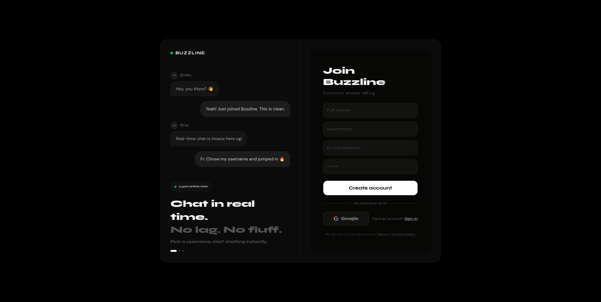
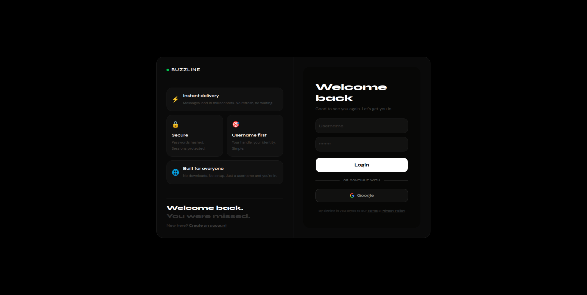
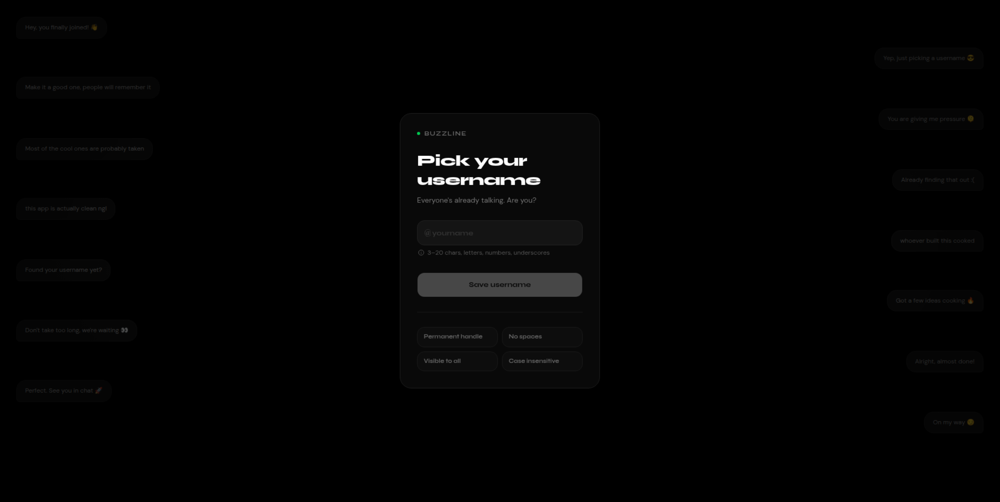
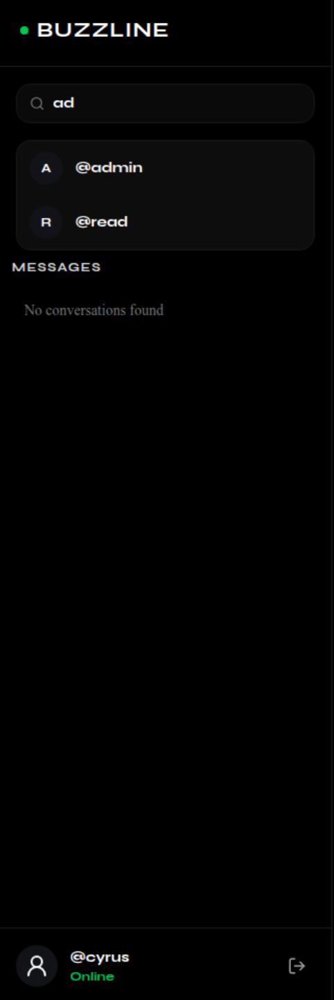
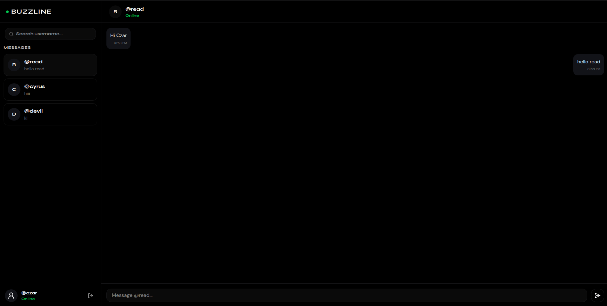
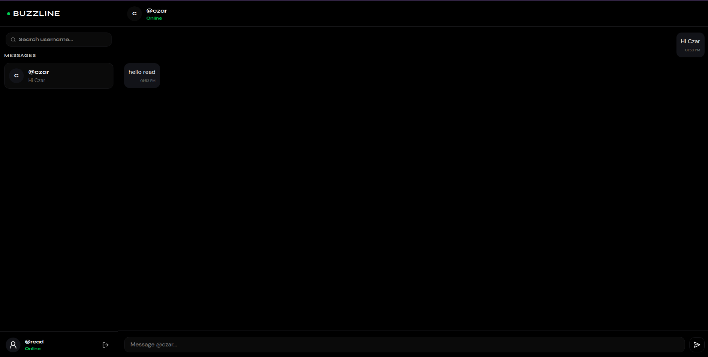
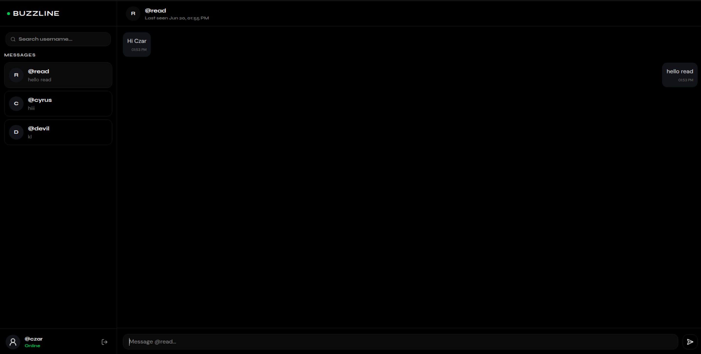
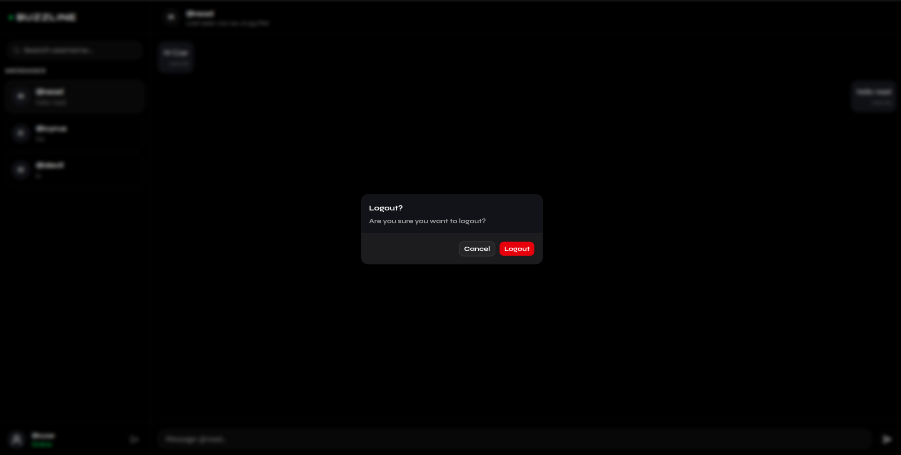

# 🚀 Buzzline

A modern real-time chat application built with **Next.js**, **Socket.io**, **MongoDB Atlas**, and **NextAuth.js**.

Buzzline allows users to create accounts, choose unique usernames, search for other users, start conversations, exchange messages in real time, and track online presence with live status updates.

---

# 📸 Screenshots

## Signup



## Login



## Choose Username



## User Search



## Chat Interface



## Online Status



## Last Seen



## Logout Confirmation



---

# ✨ Features

## Authentication & Authorization

- Google OAuth Authentication using NextAuth.js
- Credentials-Based Signup & Login
- JWT-Based Session Management
- Protected Routes
- Secure Password Hashing with bcrypt

## User Onboarding

- Unique Username Selection Flow
- Username Availability Validation
- One-Time Username Setup for Google Users
- Persistent User Profiles

## User Search

- Search Users by Username
- Debounced Search Requests
- Instant Search Results

## Real-Time Messaging

- One-to-One Conversations
- Instant Message Delivery using Socket.io
- Real-Time Chat Updates
- Automatic Conversation Creation
- Socket Room-Based Messaging

## Presence System

- Real-Time Online Status
- Last Active Tracking
- Live Presence Updates Across Clients
- Automatic Online/Offline Detection

## Chat Experience

- Latest Message Preview in Sidebar
- Automatic Conversation Sorting
- Auto Scroll to Latest Messages
- Message Timestamps
- Responsive Chat Interface

## Account Management

- Secure Logout Flow
- Session Persistence
- Protected Chat Access

## UI / UX

- AMOLED Dark Theme
- Clean Minimal Interface
- Responsive Layout
- Built with Shadcn UI
- Mobile Friendly Design

---

# 🛠️ Tech Stack

## Frontend

- Next.js 16
- React
- TypeScript
- Tailwind CSS
- Shadcn UI

## Backend

- Next.js API Routes
- Node.js
- Socket.io

## Database

- MongoDB Atlas
- Mongoose

## Authentication

- NextAuth.js
- Google OAuth
- JWT

---

# 📂 Project Structure

```bash
Buzzline
│
├── src
│   ├── app
│   ├── components
│   ├── lib
│   ├── models
│   ├── schemas
│   └── types
│
├── public
│
├── socket-server
│   ├── server.js
│   └── User.js
│
├── .env.local
│
└── README.md
```

---

# ⚙️ Environment Variables

Create a `.env.local` file in the root directory:

```env
MONGODB_URI=your_mongodb_connection_string

NEXTAUTH_SECRET=your_nextauth_secret

NEXTAUTH_URL=http://localhost:3000

GOOGLE_CLIENT_ID=your_google_client_id

GOOGLE_CLIENT_SECRET=your_google_client_secret

NEXT_PUBLIC_SOCKET_URL=http://localhost:3001
```

---

# 🚀 Getting Started

## Clone Repository

```bash
git clone https://github.com/Czar-16/BuzzLine.git

cd BuzzLine
```

---

## Install Frontend Dependencies

```bash
npm install
```

---

## Install Socket Server Dependencies

```bash
cd socket-server

npm install
```

---

## Run Frontend

```bash
npm run dev
```

Application will be available at:

```txt
http://localhost:3000
```

---

## Run Socket Server

Open another terminal:

```bash
cd socket-server

node server.js
```

Socket server runs at:

```txt
http://localhost:3001
```

---

# 🔄 Real-Time Architecture

```text
User A
   │
   ▼
Socket.io Server
   │
   ▼
User B

Messages and presence updates are broadcast
through conversation rooms in real time.
```

---

# 📈 Key Highlights

- Built a production-style real-time chat platform
- Implemented WebSocket communication using Socket.io
- Developed a real-time user presence system
- Integrated Google OAuth and Credentials Authentication
- Designed a responsive AMOLED dark-themed UI
- Implemented username-based user discovery
- Managed conversations and messages using MongoDB
- Built scalable conversation room architecture for messaging

---

# 🌐 Deployment

## Frontend

Deploy using:

- Vercel

## Socket Server

Deploy using:

- Railway

## Database

- MongoDB Atlas

---

# 🔮 Future Improvements

- Group Chats
- Message Reactions
- File Sharing
- Push Notifications
- Voice & Video Calling

---

# 👨‍💻 Author

### Anoop Jha ~ (Czar16)

- GitHub: https://github.com/Czar-16
- Twitter/X: https://x.com/itsCzar16

---

⭐ If you found this project useful, consider giving it a star.
